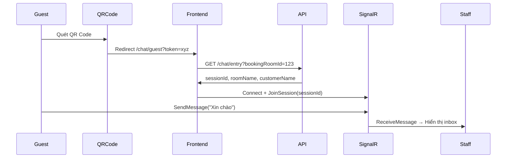
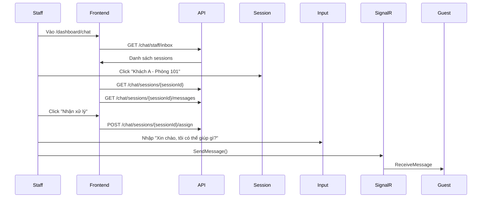
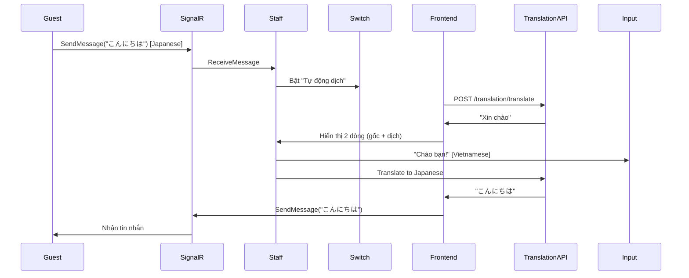

# 📱 Hướng Dẫn Sử Dụng Chat - NOVA-UI

## 📋 Mục Lục

1. [Tổng quan hệ thống Chat](#tổng-quan-hệ-thống-chat)
2. [Truy cập Chat cho Nhân viên](#truy-cập-chat-cho-nhân-viên)
3. [Truy cập Chat cho Khách hàng](#truy-cập-chat-cho-khách-hàng)
4. [Tính năng Dịch thuật](#tính-năng-dịch-thuật)
5. [Quy trình Chat End-to-End](#quy-trình-chat-end-to-end)

---

## 🎯 Tổng quan hệ thống Chat

Hệ thống chat NOVA-UI hỗ trợ giao tiếp real-time giữa khách hàng và nhân viên khách sạn với:

- ✅ **WebSocket (SignalR)** - Tin nhắn real-time
- ✅ **Dịch thuật tự động** - Hỗ trợ 8 ngôn ngữ
- ✅ **Quản lý phiên chat** - Gán nhân viên, đóng phiên
- ✅ **QR Code** - Khách quét mã để chat

---

## 👨‍💼 Truy cập Chat cho Nhân viên

### 1️⃣ Đăng nhập vào hệ thống

```
URL: http://localhost:5173/auth/login
```

### 2️⃣ Truy cập trang Chat

**Cách 1: Từ Menu Sidebar**

```
Dashboard → Chat (icon MessageSquareDot)
URL: /dashboard/chat
```

**Cách 2: Trực tiếp qua URL**

```
http://localhost:5173/dashboard/chat
```

### 3️⃣ Giao diện Chat cho Nhân viên

```
┌─────────────────────────────────────────────────────┐
│  NOVA Hotel Chat                                    │
├──────────────┬──────────────────────────────────────┤
│              │  ┌─ Header ────────────────────────┐ │
│  Inbox       │  │ Khách A - Phòng 101             │ │
│  (Sidebar)   │  │ [Ngôn ngữ] [Tự động dịch] [...]│ │
│              │  └─────────────────────────────────┘ │
│ ┌──────────┐ │                                      │
│ │ Khách A  │ │  ┌─ Messages ────────────────────┐  │
│ │ Phòng 101│ │  │ Khách: Hello                  │  │
│ │ 5 phút   │ │  │ Staff: Xin chào! [Dịch]       │  │
│ └──────────┘ │  │ ...                           │  │
│              │  └───────────────────────────────┘  │
│ ┌──────────┐ │                                      │
│ │ Khách B  │ │  ┌─ Input ──────────────────────┐  │
│ │ Phòng 203│ │  │ [Nhập tin nhắn...] [Gửi]    │  │
│ └──────────┘ │  └───────────────────────────────┘  │
└──────────────┴──────────────────────────────────────┘
```

### 4️⃣ Các thao tác chính

#### **Xem danh sách chat đang chờ**

- Sidebar bên trái hiển thị tất cả phiên chat
- Auto-refresh mỗi 30 giây
- Click vào phiên để xem chi tiết

#### **Nhận xử lý chat**

```tsx
// Khi chưa có ai nhận
Click nút "Nhận xử lý" → Chat được gán cho bạn
```

#### **Gửi tin nhắn**

```tsx
// Nhập tin nhắn → Enter hoặc click "Gửi"
// Tin nhắn gửi qua SignalR WebSocket
```

#### **Dịch tin nhắn**

```tsx
// Cách 1: Thủ công
Click "Dịch" trên từng tin nhắn → Hiển thị bản dịch

// Cách 2: Tự động
Bật "Tự động dịch" → Tin nhắn khách tự động dịch
```

#### **Đóng phiên chat**

```tsx
Click "Đóng chat" → Phiên kết thúc, không gửi tin nhắn được nữa
```

---

## 👤 Truy cập Chat cho Khách hàng

### 1️⃣ Quét QR Code trong phòng

Mỗi phòng có QR Code chứa `ChatToken`:

```
QR Code → Chứa URL:
https://nova-hotel.com/chat?token={chatToken}
```

### 2️⃣ Backend xử lý ChatToken

**API Flow:**

```typescript
// Bước 1: Khách quét QR → GET /chat/entry?bookingRoomId={id}
Response: {
  canChat: true,
  sessionId: "abc-123",
  roomName: "Phòng 101",
  customerName: "Nguyễn Văn A",
  checkinDate: "2025-11-17",
  checkoutDate: "2025-11-20"
}

// Bước 2: Frontend tự động kết nối SignalR
signalRChatService.connect()
signalRChatService.joinSession(sessionId)
```

### 3️⃣ Giao diện Chat cho Khách

```typescript
// File cần tạo: app/routes/chat/guest.tsx
import { useChatEntry } from "./container/query.hooks";

export default function GuestChat() {
  const token = new URLSearchParams(window.location.search).get('token');
  const { data: entry } = useChatEntry(token);

  if (!entry?.canChat) {
    return <div>Không thể chat. {entry?.message}</div>;
  }

  // Render chat interface...
}
```

### 4️⃣ Điều kiện để chat

Backend kiểm tra:

```typescript
✅ BookingRoom phải tồn tại
✅ Trạng thái phải là "CheckedIn" (đã nhận phòng)
✅ ChatToken hợp lệ và chưa hết hạn
✅ Trong thời gian CheckIn - CheckOut
```

---

## 🌐 Tính năng Dịch thuật

### Ngôn ngữ hỗ trợ

```typescript
const SUPPORTED_LANGUAGES = [
  { code: "vi", label: "Tiếng Việt", flag: "🇻🇳" },
  { code: "en", label: "English", flag: "🇺🇸" },
  { code: "ja", label: "日本語", flag: "🇯🇵" },
  { code: "ko", label: "한국어", flag: "🇰🇷" },
  { code: "zh", label: "中文", flag: "🇨🇳" },
  { code: "fr", label: "Français", flag: "🇫🇷" },
  { code: "de", label: "Deutsch", flag: "🇩🇪" },
  { code: "es", label: "Español", flag: "🇪🇸" },
];
```

### Cách sử dụng

#### **1. Chọn ngôn ngữ mặc định**

```tsx
// Trên header chat
Click [Globe icon] → Chọn ngôn ngữ → Lưu vào localStorage
```

#### **2. Dịch từng tin nhắn (On-demand)**

```tsx
// Click nút "Dịch" trên tin nhắn
→ Gọi API: POST /translation/translate
Request: {
  text: "Hello, I need help",
  targetLanguage: "vi",
  sourceLanguage: "auto"
}
Response: {
  translatedText: "Xin chào, tôi cần giúp đỡ",
  detectedSourceLanguage: "en"
}
→ Hiển thị cả bản gốc và bản dịch
→ Cache để lần sau không cần gọi API
```

#### **3. Tự động dịch (Auto-translate)**

```tsx
// Bật switch "Tự động dịch"
→ Mọi tin nhắn từ Guest tự động dịch khi nhận
→ Detect language → Translate → Show

// Code trong chat-main.tsx:
signalRChatService.onReceiveMessage(async (message) => {
  if (autoTranslateEnabled && message.sender === "Guest") {
    const translated = await autoTranslateMessage(message);
    setMessages(prev => [...prev, translated]);
  }
});
```

### API Translation

```typescript
// Detect language
GET /translation/detect?text={text}
Response: { language: "en" }

// Translate text
POST /translation/translate
Body: {
  text: string,
  targetLanguage: string,
  sourceLanguage: string
}
Response: {
  translatedText: string,
  detectedSourceLanguage: string
}
```

---

## 🔄 Quy trình Chat End-to-End

### Scenario 1: Khách hàng bắt đầu chat



### Scenario 2: Nhân viên trả lời



### Scenario 3: Chat với dịch thuật



---

## 🛠️ Code Examples

### Tạo Guest Chat Page

```tsx
// File: app/routes/chat/guest.tsx
import { useState, useEffect } from "react";
import { useChatEntry } from "./container/query.hooks";
import { signalRChatService } from "~/lib/signalr";

export default function GuestChat() {
  const [token, setToken] = useState<string | null>(null);

  useEffect(() => {
    // Lấy token từ URL
    const params = new URLSearchParams(window.location.search);
    setToken(params.get("token"));
  }, []);

  const { data: entry, isLoading, error } = useChatEntry(token || "", !!token);

  if (isLoading) return <div>Đang kiểm tra...</div>;

  if (!entry?.canChat) {
    return (
      <div className="error-page">
        <h1>Không thể chat</h1>
        <p>{entry?.message || "Vui lòng kiểm tra QR code"}</p>
      </div>
    );
  }

  return (
    <div className="guest-chat">
      <header>
        <h1>{entry.roomName}</h1>
        <p>Xin chào {entry.customerName}</p>
      </header>

      {/* Chat interface tương tự staff */}
      <ChatMain sessionId={entry.sessionId} isGuest={true} />
    </div>
  );
}
```

### Sử dụng Translation Hooks

```tsx
import { useTranslateMessage } from "./container/translation.hooks";
import { useChatTranslationStore } from "~/store/chat-translation.store";

function MyChat() {
  const { userLanguage, setUserLanguage } = useChatTranslationStore();
  const { translateMessage } = useTranslateMessage();

  const handleTranslate = async (message) => {
    await translateMessage(message, (msgId, updates) => {
      // Update message state
      setMessages((prev) =>
        prev.map((m) => (m.id === msgId ? { ...m, ...updates } : m))
      );
    });
  };

  return (
    <div>
      <select onChange={(e) => setUserLanguage(e.target.value)}>
        {SUPPORTED_LANGUAGES.map((lang) => (
          <option value={lang.code}>{lang.label}</option>
        ))}
      </select>

      <button onClick={() => handleTranslate(message)}>Dịch tin nhắn</button>
    </div>
  );
}
```

---

## 📊 Database Schema (Tham khảo)

```sql
-- ChatSession
id: string (PK)
bookingRoomId: string (FK)
state: "Open" | "Closed"
startedAt: datetime
endedAt: datetime (nullable)
assignedStaffUserId: string (nullable)

-- ChatMessage
id: string (PK)
sessionId: string (FK)
sender: "Guest" | "Staff" | "System"
message: text
staffUserId: string (nullable)
staffName: string (nullable)
createdAt: datetime

-- ChatToken (trong BookingRoom)
chatToken: string (unique)
chatTokenExpiry: datetime
```

---

## 🔧 Troubleshooting

### Lỗi: "Không thể kết nối SignalR"

```typescript
// Kiểm tra .env
VITE_API_URL=http://localhost:5000

// Kiểm tra backend WebSocket endpoint
http://localhost:5000/hubs/chat
```

### Lỗi: "canChat: false"

```typescript
// Nguyên nhân:
1. BookingRoom không ở trạng thái "CheckedIn"
2. ChatToken hết hạn hoặc không hợp lệ
3. Chưa đến ngày CheckIn hoặc đã quá CheckOut

// Giải pháp:
- Check trạng thái booking trong DB
- Regenerate ChatToken từ quản lý phòng
```

### Lỗi: "Translation failed"

```typescript
// Kiểm tra Translation API
POST http://localhost:5000/translation/translate

// Kiểm tra response cache
console.log(translationCache); // Map<string, TranslationCache>
```

---

## 📝 Checklist Triển khai

### Cho Nhân viên:

- [x] Route `/dashboard/chat` hoạt động
- [x] Sidebar hiển thị inbox
- [x] Click session → Load messages
- [x] Gửi tin nhắn qua SignalR
- [x] Nhận tin nhắn real-time
- [x] Dịch thuật on-demand
- [x] Dịch thuật tự động
- [x] Gán nhân viên
- [x] Đóng phiên chat

### Cho Khách hàng:

- [ ] Tạo route `/chat/guest`
- [ ] Xử lý QR code token
- [ ] Kiểm tra `canChat`
- [ ] Giao diện chat đơn giản
- [ ] Gửi/nhận tin nhắn
- [ ] (Optional) Translation cho khách

### Backend:

- [ ] API `/chat/entry` hoạt động
- [ ] SignalR Hub `/hubs/chat` running
- [ ] Translation API `/translation/translate`
- [ ] ChatToken generation/validation
- [ ] BookingRoom status check

---

## 🎉 Kết luận

Hệ thống chat NOVA-UI đã sẵn sàng cho nhân viên. Để hoàn thiện cho khách hàng:

1. **Tạo Guest Chat Page** (`/chat/guest.tsx`)
2. **Generate QR Codes** cho mỗi phòng
3. **Test flow end-to-end** với backend
4. **Deploy** và test trên thiết bị thật

Nếu cần hỗ trợ thêm về bất kỳ phần nào, hãy liên hệ!
